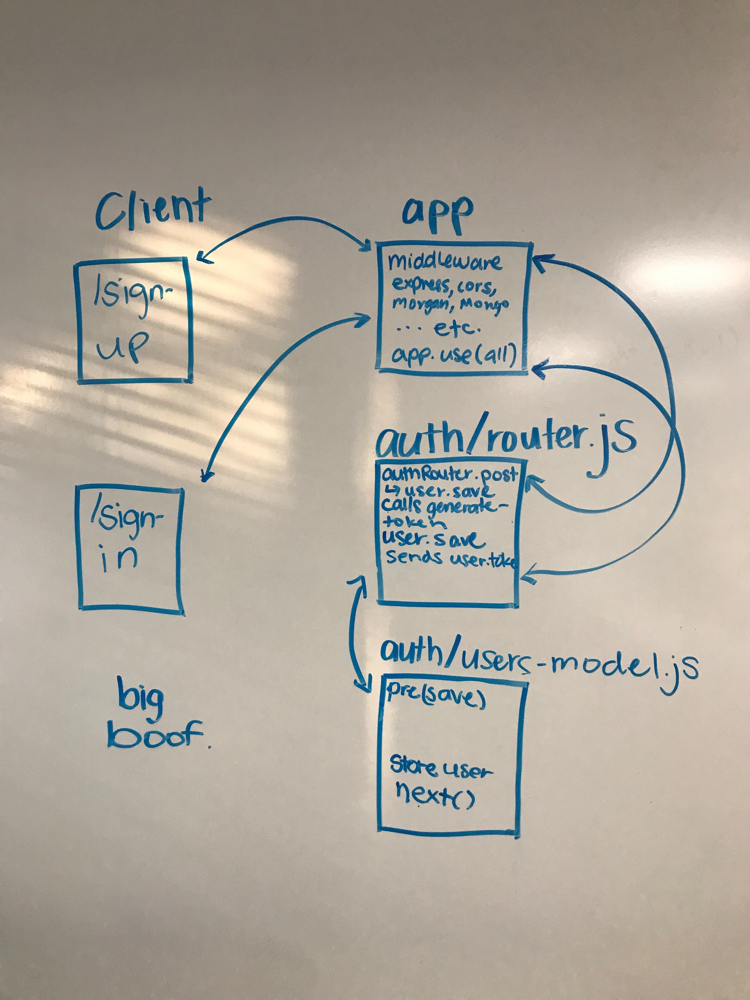

# Lab-class-11
# Authentication

### Author: Brad Smialek

### Links and Resources
* [submission PR](https://github.com/brad-smialek-401-advanced-javascript/lab-class-11/pull/2)
* [travis]()
* [back-end](https://whispering-journey-71486.herokuapp.com/) (when applicable)
* [front-end](localhost: 3000) (when applicable)

#### Documentation
* [api docs](http://xyz.com) (API servers)

### Modules
#### `modulename.js`
##### Exported Values and Methods

###### `foo(thing) -> string`
Usage Notes or examples

###### `bar(array) -> array`
Usage Notes or examples

### Setup
#### `.env` requirements
* `PORT` - 3000
* `MONGODB_URI` - URL to the running mongo instance/db

#### Running the app
* `npm start`
* Endpoint: `/foo/bar/`
  * Returns a JSON object with abc in it.
* Endpoint: `/bing/zing/`
  * Returns a JSON object with xyz in it.
  
#### Tests
* How do you run tests?
* What assertions were made?
* What assertions need to be / should be made?

#### UML
